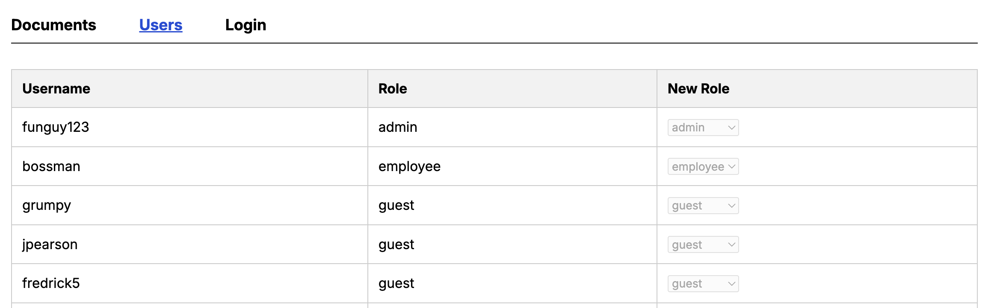
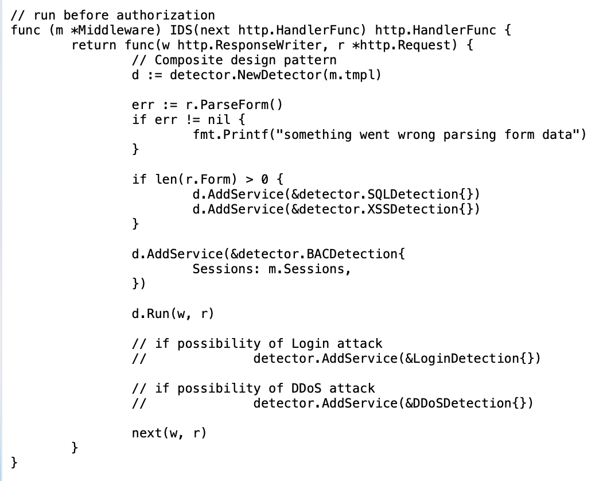
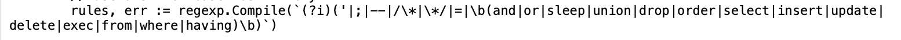
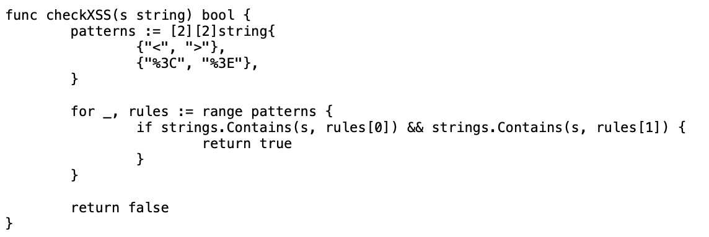
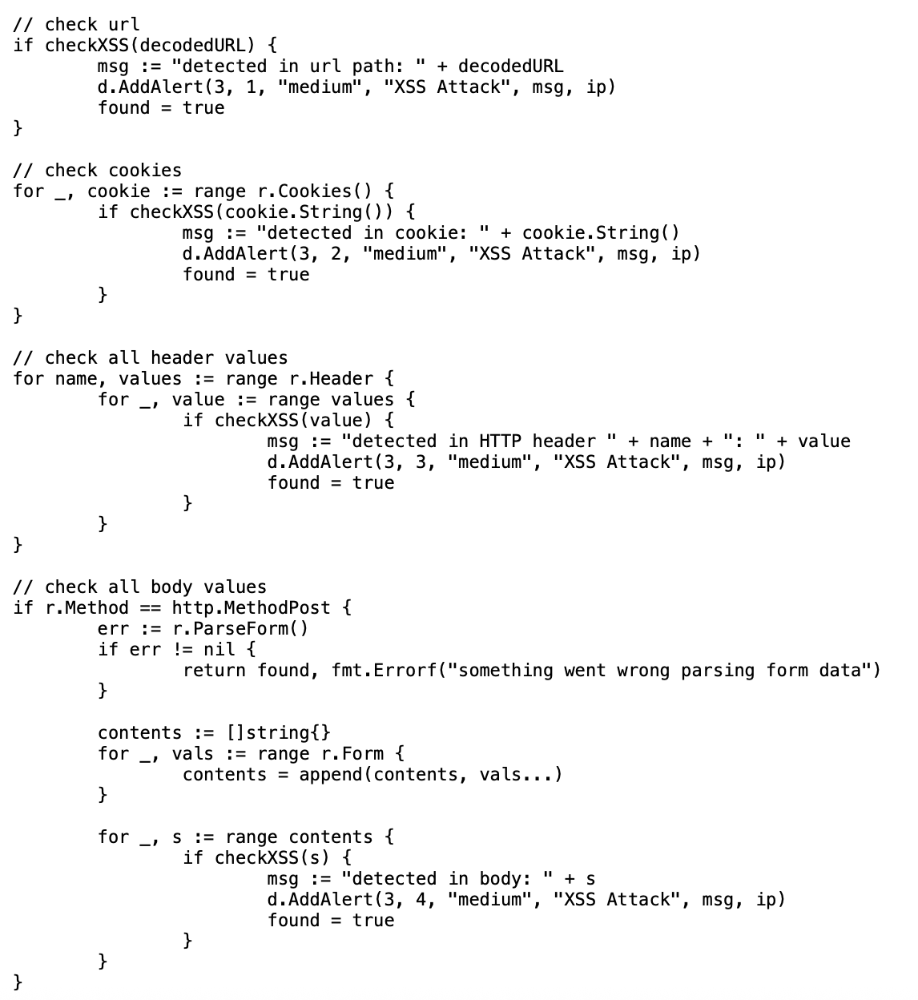
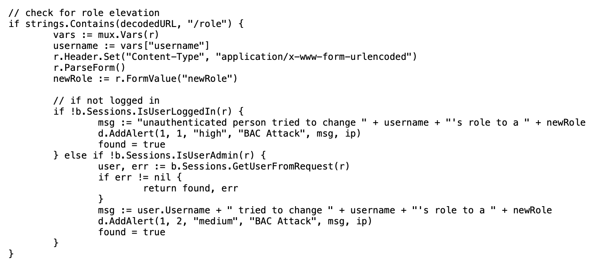
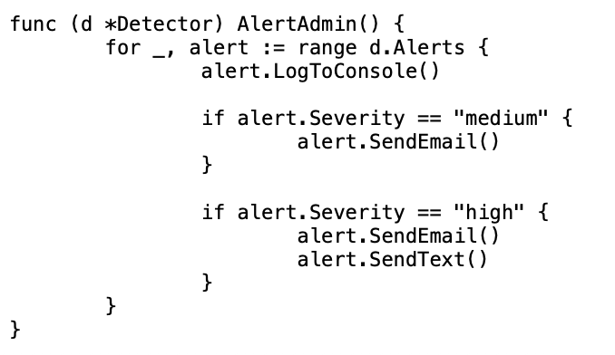

# Network Intrustion Detection System (IDS)

## Abstract
This is a Network Intrusion Detection System prototype for a REST API made in Golang. The system detects attacks such as SQL Injection, XSS, broken access control, and more going forward. The site is hosted and can be accessed [here](http://server-ids.up.railway.app). The site serves as a company website for internal users to view shared documents. This shows a real world example of how an IDS can be used to find attacks that could happen on an application like this. Going forward an IPS can be added to it to prevent attacks once they are detected.

## Introduction

When I was first tasked with making a network intrusion detection system (IDS)
I was initally thinking of just making something simple using Linux commands
to detect a few coommon attacks and call it a day. However, as I thought about it
more I wanted to implement the system into something I am interested in to turn this into
a more useful learning opportunity and something I could possibly use in the future. I
decided to make the IDS for a REST API since I enjoy doing software development
and wanted to improve my backend development skills. I made it in Go since it's a language
I like but I haven't had the opportunity to use much. I chose a REST API as the target because of the variety
of security risks that come with it such as SQL injections, XSS attacks, broken access control, login attacks, and DoS attacks.
My goal is to develop a system that can detect these attacks effectively before they cause any damage.

Before starting development of the system I looked at it from a high level perspective
to see exaclty how it should be setup. The way I saw it was that the attacker would make a call to the
API then the incoming traffic would be inspected in the middleware before it can be recieved.
From there I would check for intrusions and decide to pass or not. In the case of a detected attack I would alert the admin of what happened and log them in the console. I also may expand it to prevent attacks by setting up
firewalls based on what attack is detected to keep the server running wihtout any issues.
On top of that I will look to optimize the performance of the IDS by running checks only for attacks that are possible with the incoming traffic.
I also may run the detections using multithreading which will keep the performance of the system as high as possible.

## System Architecture

> **UML (Inital Design)**   

> **High Level Design** 

> **System Process** 

## Threat Model

The attacker in this instance would be someone trying to access information or documents that they don't have access to. 
The attacker could also be trying to alter or destroy information. This attempts to mock a real world example where a company 
has a site to share documents with all internal members. The attacker would launch attacks by trying to inject
SQL commands, malicious code, or getting access to higher roles to get what they can out of it. The types of attacks they would use
are SQL injection, XSS, broken access control, and login attacks. Upon opening the site a login page will be shown. The attacker can use this as a way to launch many different attacks. A SQL injection attack can take place by entering a username or password that would
trick the SQL command into doing something it's not supposed to like logging in without the right credentials or destroying a table in the database. By doing a similar action a XSS attack could also take place by inserting code into the URL or into inputs for username or password. This can be done using HTML script tags which the attacker would use by sending out URLs with these tags that would run mailicious code on the site or on a users device if they click the link. Login attacks could also occur from this page through trying many username and password combinations. Another place where attacks can happen is on the users page. By default the users page is blocked if the user isn't logged in. If a user is logged in they can see all of the users on the site and their roles. If they are an admin they can change any users' role otherwise they can't. In this case broken access control can take place since the attack would try to elevate their role to access this page. The attacker could also be someone from within the company that is trying to elevate their role so they can access locked documents. On the user page there are dropdowns to change the users' role and if the current user isn't an admin then the dropdowns would be disabled. 

*The user page from the perspective of a user with the guest role*

To bypass this an attacker could inspect element to enable the dropdown and try to change the role anyways. Another type of attack that can occur in all parts of the site is a DoS (denial of service) attack which would occur if an attacker overloads the site with traffic.

## Defense Model

The defense model is set up to detect most of the attacks that the attacker could use. The types of attacks that the defense model tries to detect are SQL injection, XSS, broken access control, login attacks (haven't implemented yet), and potentially DoS attacks. To do this the IDS is placed in the middleware so that incoming traffic can be inspected before any action is taken on it. The IDS is setup so that it will only run specific detections if they are possible which is implemented using the composite design pattern. 

For detecting SQL injection, I used a signature based detection to identify possible attacks. The rules included using quotes, commands (like DROP, SLEEP, DELETE), and common symbols used in SQL injections (like =, ;, and --). 

While the rules cover many cases it also will lead to false alarms since people use these especially in passwords. To offset this issue I set the alerts as medium severity and made sure the rules are as specific as possible. I check for SQL injection inside of the URL, cookies, HTTP header, and HTTP body. To detect XSS attacks I did something similar using signature based detection but this time I had it so it is only when there are two angle brackets (< and >) in a string. This is because XSS attacks are launched using the HTML script tag so it would need to have those brackets to do so. I could have also just made the script tag as the rule but I did angle brackets just incase if they try anything clever using any HTML tags. I also added the URL encoding (%3C and %3E) for angle brackets as a rule since it can be ran through a URL as well. 

I check for XSS attacks in the URL, cookies, HTTP header, and HTTP body. 

For broken access control I want to check for anytime a role is being elevated using anomaly based detection. Since only admins should have the ability to change a users' role I would check to see if the person changing someones role is logged in or an admin. If not it detects it as an attack and a high servity if a non user does so since it means that they were able to bypass into an authorized page if they were able to do this. 

This detection could also extend to someone viewing a locked document without having the correct role or accessing the API with suspious header information. 

As for login attacks the detection isn't set up yet but it would check for brute force attempts, suspious username/password, trying to login to many different accounts from the same IP, or login attempts on a user from a suspicious location. This would mainly use anomaly based detection mixed in with some signature based detection as well. 

For DoS attacks detection isn't set up yet either but it would be based on the amount of requests made in a certain amount of time. Once an attack is detected an alert is sent containing the signature ID, revision number, severity, attack type, date/time, and a message of what happened. 

The alerts are currently being sent to the console but they can easily be sent as an email, text message, or logged to a file depending on the severity of the attack. 

To block attacks requests can be dropped as soon as it is detected since the detector runs in the middleware so the system wouldn't be effected. Some attacks are questionable as to if they can be stopped such as a XSS attack where a user clicks a bad link and it takes their cookies since that would be before they access the system but even in this case, CSRF (cross site request forgery) tokens would be a way to prevent this. Adding a IPS to the IDS would help stop attacks by taking actions like setting up firewalls once attacks are detected. DDoS attacks would be a challenge since I wouldn't be able to use a singular IP to prevent or stop it so the service would likely go down.
